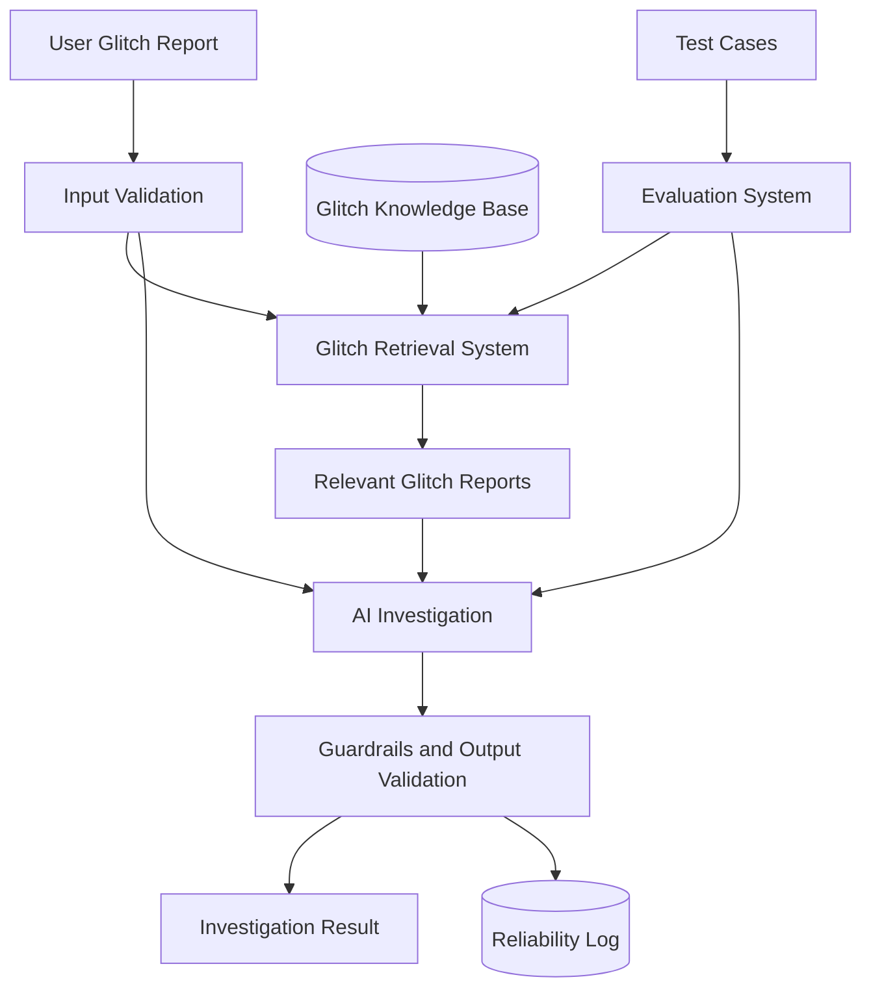

# Game Glitch Investigator

Game Glitch Investigator is a Python and Streamlit project that is being extended with retrieval-augmented generation (RAG). A player will describe a game problem, the system will search a local collection of known reports, and an AI investigation will use the retrieved evidence to suggest likely causes and troubleshooting steps. Grounding the investigation in traceable reports matters because a generic AI answer can sound confident even when it has no evidence relevant to the user's game or symptoms.

## Original Project

The original Modules 1–3 project was **Game Glitch Investigator: The Impossible Guesser**, a deliberately buggy number-guessing game built with Streamlit. Its goals were to practice debugging AI-generated Python, correct game-state and higher/lower hint errors, preserve values across Streamlit reruns, and begin moving testable game logic out of the UI. The game currently supports three difficulty levels, attempt limits, scoring, guess history, hints, and session-state-based play.

The project is now evolving from that debugging exercise into an investigation assistant. The existing game code remains in `app.py` during the first RAG milestone so that its behavior and functions are not silently removed while the new foundation is developed and tested.

## Current Project Status

The first RAG foundation is implemented:

- A local JSON knowledge base contains clearly labeled synthetic demonstration reports.
- A deterministic keyword retriever ranks reports using description overlap plus game and platform matches.
- Labeled test cases verify the expected top report ID and glitch category.
- Unrelated descriptions can produce an explicit no-match result.
- The architecture diagram includes the future AI, guardrail, evaluation, and logging flow.

The Streamlit form, AI-generation call, output guardrails, and runtime investigation logger are the next integration milestone. Running `app.py` currently opens the original guessing game; this README does not claim that the unfinished AI integration is already available.

## Architecture Overview

The Mermaid source is stored in [`diagrams/architecture.mmd`](diagrams/architecture.mmd). Its main runtime flow is:

1. A user submits a structured glitch report.
2. Input validation checks the report before processing.
3. The retrieval system searches `data/glitch_reports.json`.
4. Relevant reports provide evidence to the AI investigation component.
5. Guardrails check the generated response and distinguish evidence, likely explanations, troubleshooting, and uncertainty.
6. The validated investigation is returned and execution details are written to the reliability log.

The testing path is separate from the user path. Labeled cases enter the evaluation system, which checks whether retrieval returns the expected report and category. This makes retrieval quality measurable without relying on subjective AI output.



## Repository Structure

```text
.
├── app.py                         # Existing Streamlit guessing game
├── logic_utils.py                 # Original refactoring placeholders
├── retrieval.py                   # Local report loading and ranking
├── data/
│   └── glitch_reports.json        # Synthetic demonstration knowledge base
├── diagrams/
│   └── architecture.mmd           # Mermaid architecture source
├── logs/
│   └── .gitkeep                   # Keeps the future log directory in Git
└── tests/
    ├── test_cases.json            # Expected report IDs and categories
    ├── test_retrieval.py          # Retrieval reliability checks
    ├── test_bug_fixes.py          # Existing game bug-regression tests
    └── test_game_logic.py         # Existing logic-refactoring tests
```

## Setup Instructions

### Requirements

- Python 3.10 or newer
- `pip`

### Install and run

1. Clone the repository and enter it:

   ```bash
   git clone <your-repository-url>
   cd applied-ai-system-project
   ```

2. Create a virtual environment:

   ```bash
   python -m venv .venv
   ```

3. Activate it on macOS or Linux:

   ```bash
   source .venv/bin/activate
   ```

   On Windows PowerShell:

   ```powershell
   .venv\Scripts\Activate.ps1
   ```

4. Install dependencies:

   ```bash
   python -m pip install -r requirements.txt
   ```

5. Run the retrieval reliability tests:

   ```bash
   python -m pytest -q tests/test_retrieval.py
   ```

6. Run the complete test suite:

   ```bash
   python -m pytest -q
   ```

7. Run the current Streamlit application:

   ```bash
   python -m streamlit run app.py
   ```

No API key is required for the current local retrieval milestone. API credentials must never be committed when the AI-generation component is added.

## Sample Interactions

The following examples were executed against the current retriever. All records are instructor-created synthetic demonstrations, not claims about official bugs in a real game.

### Example 1: Graphics symptoms

**Input**

```text
Game: Example Game
Platform: PC
Description: Textures become black and objects flicker after changing graphics settings.
```

**Current system output**

```text
Top report: glitch-001
Category: graphics
Relevance score: 10.0
Source: Instructor-created synthetic demonstration record
```

The future AI response will use that report's evidence to discuss graphics settings, drivers, shader cache, and file verification while marking those explanations as possibilities rather than confirmed causes.

### Example 2: Missing save progress

**Input**

```text
Game: Example Game
Platform: PC
Description: My recent progress and inventory disappear when I load my save.
```

**Current system output**

```text
Top report: glitch-002
Category: save_state
Relevance score: 7.0
Additional result: glitch-003, category mod_conflict, score 5.0
```

The lower-ranked result illustrates why ranking and guardrails matter: the final investigation should prioritize the save-state evidence and communicate uncertainty instead of treating every retrieved item as equally relevant.

### Example 3: Crash after installing a mod

**Input**

```text
Game: Example Game
Platform: PC
Description: The game crashes while loading after installing a mod, but starts with mods disabled.
```

**Current system output**

```text
Top report: glitch-003
Category: mod_conflict
Relevance score: 11.0
Additional result: glitch-002, category save_state, score 4.0
```

The grounded investigation will be able to recommend backing up save data, disabling recent mods, checking versions and dependencies, and enabling mods one at a time because those steps are present in the retrieved synthetic report.

### No-match behavior

An unrelated controller-battery description returns an empty result list. The integrated application must translate this into a clear message that no relevant local report was found instead of inventing evidence.

## Design Decisions and Trade-offs

### Local JSON knowledge base

JSON keeps the reports human-readable, version-controlled, and easy to inspect during grading. It avoids database setup for a small demonstration corpus. The trade-off is that loading and scanning one file will not scale well to a large production knowledge base.

### Keyword retrieval before embeddings

The first retriever uses normalized keyword overlap, with small bonuses for exact game and platform matches. This approach is deterministic, fast, explainable, offline, and requires no embedding API or vector database. It understands neither synonyms nor meaning as well as semantic retrieval, so phrasing differences can reduce recall and common terms can create weaker secondary matches.

Game and platform metadata can improve the order of results, but they cannot create a match by themselves. A report must share meaningful description terms with the query. This decision supports honest no-match behavior.

### Synthetic records only

The repository does not present invented glitches as official game bugs. Every current record is labeled `Instructor-created synthetic demonstration record`. Real reports should only be added later with verifiable source information and appropriate permission to store the content.

### Separate retrieval tests

Retrieval reliability is tested independently from future AI generation. This isolates ranking failures, keeps tests deterministic, and avoids network costs. It does not evaluate whether a future generated explanation is clear, safe, or faithful, so output evaluation and guardrail tests are still required.

### Preserve existing behavior during migration

The original application has not yet been replaced by the investigation form. Keeping the RAG foundation separate makes the change reviewable and prevents an unfinished integration from breaking the existing Streamlit experience. The trade-off is that the repository temporarily contains an original app and a new retrieval component that are not connected.

## Testing Summary

The retrieval test suite currently passes:

```text
python -m pytest -q tests/test_retrieval.py
2 passed
```

It verifies that all three labeled examples return the expected top report ID and category, and that an unrelated description returns no reports. Both JSON files were also checked with Python's JSON parser, and `retrieval.py` compiles successfully.

The full repository suite currently reports **15 passed and 3 failed**. The three failures are inherited from the original project: `logic_utils.py` still contains `NotImplementedError` placeholders, while equivalent game functions remain in `app.py`. There is also an older test-contract mismatch because one test expects only an outcome string while the application returns an outcome and message tuple. These known failures should be resolved during the integration/refactoring phase rather than hidden in this documentation milestone.

What worked well was using labeled cases as executable retrieval checks; this immediately exposed whether ranking returned the intended record. The main lesson was that metadata bonuses should improve ranking but should not turn an unrelated query into a relevant match.

## Next Steps

1. Complete and standardize the original reusable game logic without losing regression coverage.
2. Add the six-field glitch-report form and input validation.
3. Connect `retrieve_glitches()` to the Streamlit execution flow.
4. Add a mockable AI investigation component grounded only in retrieved reports.
5. Validate output and clearly handle no-match and model-error cases.
6. Write privacy-conscious JSON logs and add reliability tests for logging and generated categories.
7. Expand the corpus only with clearly labeled synthetic data or verified, cited reports.
